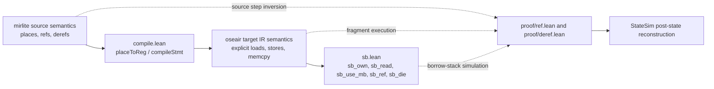
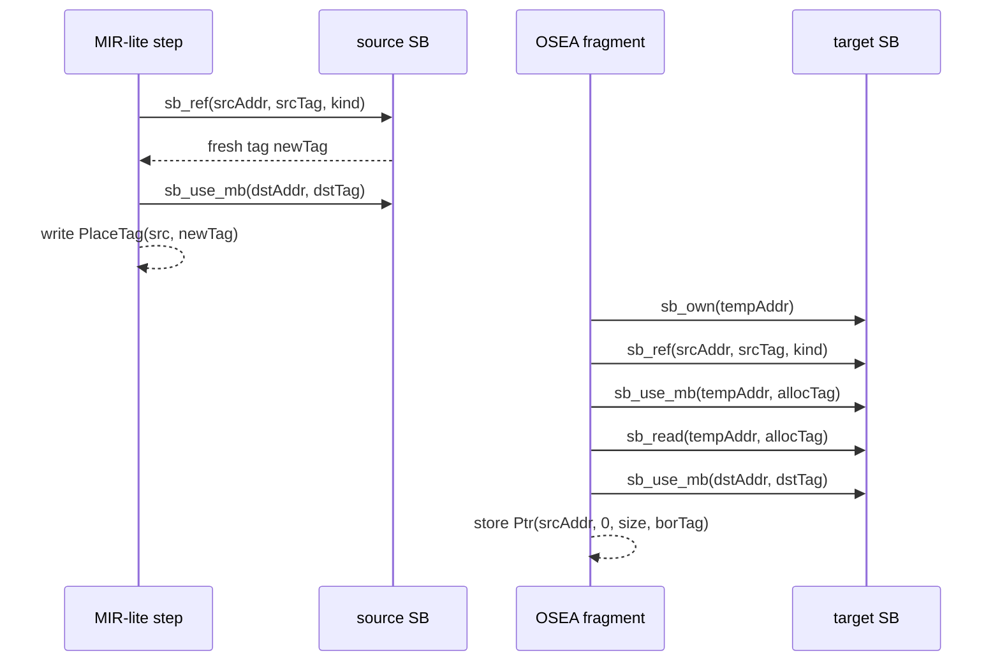
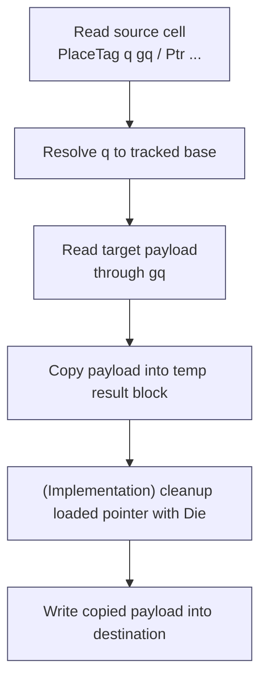
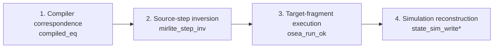

# Local Simulation for a Borrow-Aware Compiler Correctness Argument

_Page citations below refer to the page numbers of the local PDFs in `references/papers/`._

## Abstract

This draft explains the proof strategy currently emerging in `obseq`: a compiler-correctness argument for a small Rust-like source language (`mirlite`) and a lower-level imperative target IR (`oseair`) equipped with an explicit operational borrow discipline. The central design choice is not to prove correctness by a single monolithic induction over whole programs. Instead, the development factors the argument through short compiled fragments for semantically rich source operations, together with local simulation lemmas that reconstruct the source-target relation after each fragment executes. The result is closest in spirit to CompCert-style semantic preservation, but with a much more local proof granularity; closest in target/source mismatch to Velus, but for references and borrow-sensitive memory rather than synchronous streams; and closest in alias reasoning to RustBelt and Stacked Borrows, but with the borrow discipline exposed directly in the target operational semantics rather than hidden inside a semantic model (Leroy 2006, pp. 1-3; Bourke et al. 2017, pp. 1-2; Jung et al. 2018, pp. 1-5; Jung et al. 2020, pp. 1-4).

Two case studies organize the discussion. The first is `RefOp`, where a source-level reference creation is lowered to a compact four-instruction target fragment. The second is `DrefOp`, where dereference and assignment are decomposed into explicit pointer load and memory copy steps. These examples show the main benefit of the approach: the correctness argument follows the compiler cases that matter to the user. They also expose its cost: the proof carries a visible amount of simulation infrastructure, including address and tag renamings, block-level memory agreement, and custom state-reconstruction lemmas. The current mechanization already isolates these obligations cleanly, but it still contains explicit axiomatized helper lemmas and one known mismatch between the intended `DrefOp` cleanup story and the proof file that models it.

## 1. Introduction

The standard verified-compilation story is now well understood. CompCert showed that a realistic compiler can be implemented and proved correct inside Coq, with semantic preservation phrased as a machine-checked theorem about source and target behaviors (Leroy 2006, pp. 1-3; Leroy 2009, pp. 1-3). Subsequent work widened the space of examples. Velus showed how to relate a stream-based synchronous source semantics to imperative generated code by introducing intermediate languages and carefully chosen relational invariants (Bourke et al. 2017, pp. 1-2). Vellvm showed how much mileage one can get from a precise mechanization of an IR, its memory model, and several compatible operational semantics designed to support different proof styles (Zhao et al. 2012, pp. 1-2). CertiCoq and later compositional work explored proof techniques better suited to higher-order languages and multi-pass pipelines, including logical relations and compositional compilation theorems (Anand et al. 2017, pp. 1-2; Paraskevopoulou and Appel 2019, pp. 1-3; Paraskevopoulou, Li, and Appel 2021, pp. 1-4).

The present development occupies a different but recognizable corner of that landscape. The source language is not a general-purpose higher-order language, and the target is not machine code. Instead, `obseq` studies a smaller and sharper problem: how to give a convincing compiler-correctness argument for Rust-like place, reference, and dereference operations when the target makes borrow-sensitive memory actions explicit. That choice changes the shape of the proof. The hardest part is not closure conversion, register allocation, or separate compilation. The hard part is explaining why the source operation "take a reference" or "dereference a pointer-shaped value and then write the result" is faithfully implemented by a short imperative target fragment that performs explicit reads, writes, borrow-stack operations, and temporary cleanups.

This is exactly where the `obseq` proof style becomes interesting. The source of truth for the current design is the code itself: [src/obseq/compile.lean](src/obseq/compile.lean) defines the lowering from `mirlite` statements and expressions to `oseair`; [src/obseq/sb.lean](src/obseq/sb.lean) defines the borrow-stack machine with operations such as `sb_own`, `sb_read`, `sb_use_mb`, `sb_ref`, and `sb_die`; [src/obseq/proof/core.lean](src/obseq/proof/core.lean) packages the main simulation relation `StateSim`; and the statement-specific files [src/obseq/proof/ref.lean](src/obseq/proof/ref.lean) and [src/obseq/proof/deref.lean](src/obseq/proof/deref.lean) instantiate the pattern for `RefOp` and `DrefOp`.

The main claim of this draft is that the local, fragment-oriented strategy used here is a good match for this compiler. It combines three ideas that are usually separated. First, like CompCert, it is still recognizably a semantic-preservation argument over source and target executions (Leroy 2006, pp. 2-4). Second, like Velus, it must bridge a real semantic gap between a high-level source account and lower-level sequential memory manipulation (Bourke et al. 2017, pp. 1-2; Bourke, Brun, and Pouzet 2020, pp. 1-2). Third, like RustBelt and Stacked Borrows, it takes ownership and aliasing seriously enough that operational borrow discipline becomes part of the trusted story rather than an afterthought (Jung et al. 2018, pp. 1-5; Jung et al. 2020, pp. 3-4). What distinguishes `obseq` is that it pursues this combination through short case lemmas tied closely to compiler output.

The rest of the paper makes that claim concrete. I first summarize the architecture of the development and the simulation objects it manipulates. I then walk through `RefOp` and `DrefOp` as running examples. Those examples motivate a four-stage proof template: compiler correspondence, source-step inversion, target-fragment execution, and simulation reconstruction. I then compare this template against CompCert, Velus, Vellvm, CertiCoq, and Compositional CompCert, and close by spelling out both the advantages of the local strategy and the current proof obligations it leaves visible.

## 2. Development Overview

At a high level, `obseq` splits the world into a source semantics, a compiler, a target semantics, and an explicit operational borrow discipline.



The source language models a small Rust-like fragment in which the semantically interesting operations are over places, references, and dereferences. The target IR lowers these operations into imperative fragments over registers and memory. This lowering is intentionally explicit. In [src/obseq/compile.lean](src/obseq/compile.lean), `placeToReg` and `placeToBorrowReg` compute the pointer register that should represent a source place; `cleanupInstrs` turns temporary registers into `Die` instructions; and `compileStmt` plus `compileRExprTo` assemble these pieces into target fragments. For example, non-zero projections are lowered to borrow-producing offset instructions rather than treated as a meta-level notion of addressing. That is already a strong statement about proof structure: the compiler has chosen to expose the operational content that the proof must explain.

The target borrow model is likewise explicit. In [src/obseq/sb.lean](src/obseq/sb.lean), the borrow stack is represented as a map from addresses to stacks of `RefKind` values, with a structural well-formedness predicate `SBValid`. The operations `sb_own`, `sb_read`, `sb_use_mb`, `sb_ref`, and `sb_die` implement the operational rules that govern ownership, reading, mutable use, reference creation, and cleanup. This design is closest in spirit to Stacked Borrows, which also uses a per-location stack discipline to distinguish permissible from impermissible aliasing patterns (Jung et al. 2020, pp. 3-4). The difference is that `obseq` embeds the stack machine directly in the target operational layer rather than using it only as a semantic metalanguage.

The proof layer then packages the relation between source and target states. The crucial object is `StateSim` in [src/obseq/proof/core.lean](src/obseq/proof/core.lean). It is not a single undifferentiated simulation relation. Instead, it combines:

1. a global borrow-stack correspondence `sb_sim rho_a rho_t s_mir.ap s_osea.ap`;
2. a place-by-place runtime correspondence for every compiler-tracked source base;
3. a block-level memory agreement relation `block_sim_at`;
4. disjointness facts for tracked blocks; and
5. a pointer-cell interpretation parameterized by `ptr_sim`, with `defaultPtrSim` and `ptrSimOfCtx` as the main instances.

This packaging matters. In CompCert, the memory model is central because program transformations rearrange memory blocks while preserving observable behavior (Leroy and Blazy 2008, pp. 1-3). In `obseq`, memory agreement is not enough. The relation must also explain why a source `PlaceTag` in memory corresponds to a target `Ptr`, and why source and target tags can differ while still being related. That is why `StateSim` is parameterized by address and tag renaming maps `rho_a` and `rho_t`, and why `ptrSimOfCtx` consults the source environment and path-resolution function to validate a pointer-shaped target cell.

The proof files follow a very regular shape. Each statement-specific file introduces:

- a context structure, such as `RefExistingCtx` or `DerefExistingCtx`;
- a theorem-facing abbreviation for the source statement and the temporary registers it uses;
- a compiler-correspondence lemma `compiled_eq`;
- a source-step inversion lemma `mirlite_step_inv`;
- a target-execution lemma `osea_run_ok`; and
- a final theorem `simulation`.

The theorem statements do not hide the proof obligations; they expose them in a way that can be narrated directly. That readability is one of the strongest arguments for the approach.

## 3. Running Example I: `RefOp`

The `RefOp` proof is the cleanest expression of the local strategy. The source statement is a base-only assignment of a newly created reference to an existing destination:

```text
Assgn (Place dst) (RefOp kind src)
```

The current proof file [src/obseq/proof/ref.lean](src/obseq/proof/ref.lean) models the existing-destination, base-only case parametrically over the reference kind (`Shared`, `Mut`, or `Raw`). In this setting, the compiler fragment has exactly four instructions:

```text
Assgn resReg (Alloc PTy)
Assgn borReg (BorOffset/MutBorOffset/CopyOffset srcReg 0)
RStore PTy borReg resReg
Memcpy dstReg resReg PTy
```

This is a good example because the source step is semantically rich and the target fragment is operationally concrete. Source-side, creating a reference is not "just a value construction". It changes the borrow discipline, creates a fresh tag, and stores a pointer-shaped value into memory. Target-side, the effect is decomposed into allocation, borrow creation, pointer store, and copy.

The current proof skeleton splits accordingly.

**Lemma 1 (`compiled_eq`, human reading).**  
If `compileStmt` is invoked on the base-only `RefOp` statement in a context where both source and destination places are already tracked, then the emitted OSEA fragment is exactly the four instructions shown above. This is the paper-friendly version of `compiled_eq` in `ref.lean`.

**Lemma 2 (`mirlite_step_inv`, human reading).**  
If the MIR statement steps, then we can recover the precise source-side borrow actions that made it possible: an `sb_ref` on the source address, an `sb_use_mb` on the destination address, freshness of the new tag, and the concrete post-state in which the destination memory cell now stores `PlaceTag src newTag`.

**Lemma 3 (`osea_run_ok`, human reading).**  
If the target registers and borrow-stack premises line up with the four instructions, then `runN 4` over the target program reaches the expected post-state, with the fresh pointer cell installed in memory and the right intermediate register contents.

**Lemma 4 (`state_sim_write_extend_rho_t`, human reading).**  
If source and target were related before the step, and the destination block was the one updated, and the new pointer values correspond under an extension of the tag renaming, then the post-states are related again under the extended renaming.

The proof itself then becomes almost textbook:

1. use `StateSim.place` to recover the concrete runtime facts for `src` and `dst`;
2. invert the source step with `mirlite_step_inv`;
3. thread the borrow-stack simulation through `sb_own`, `sb_ref`, `sb_use_mb`, and the target-side read/write actions;
4. discharge target execution via `osea_run_ok`; and
5. rebuild `StateSim` with `state_sim_write_extend_rho_t`.

The pleasing aspect of this proof is that the local theorem is not an arbitrary script. It mirrors the compiler's own decomposition. The proof spends its energy exactly where the semantic novelty lies: reconciling a source-level notion of reference creation with an explicit target fragment that manipulates borrow permissions, pointers, and memory cells.



This example also shows the main downside of the local strategy. The proof is simple only after a nontrivial amount of infrastructure has been built. The key technical burden is that the target writes a pointer value while the source writes a place-and-tag value. A plain memory equality is impossible. Instead, the proof has to widen the simulation relation through `ptrSimOfCtx`, extend the tag renaming, and prove a custom memory-value agreement fact. The code does this explicitly by constructing a one-cell `mem_vals_eq` witness and then invoking `state_sim_write_extend_rho_t`.

`RefOp` is a good stress test for the overall design. The good news is that it solves the case cleanly. The warning is that every nearby construct that writes a semantically rich value is likely to need its own reconstruction lemma.

## 4. Running Example II: `DrefOp`

`DrefOp` is more subtle because it forces the development to talk about a value that is already pointer-shaped in memory. The source operation reads a stored pointer-like cell, resolves the pointed-to place, reads through that place, and writes the dereferenced payload into the destination. In human terms, this is the first place where the proof genuinely needs a notion of indirection rather than simple place selection.

The current conceptual story is easy to state. Source-side, `DrefOp` proceeds in two logical stages:

1. read the pointer-like source cell, obtaining a place `q` and guard tag `gq`;
2. follow `q`, read the payload at the referenced block, and then write it into the destination.

The source inversion lemma in [src/obseq/proof/deref.lean](src/obseq/proof/deref.lean) states exactly this. It recovers an `sb_read` at the source cell, the `PlaceTag q gq` stored there, a lookup showing that `q` corresponds to a tracked base-only place, a second `sb_read` through the target address, and finally an `sb_use_mb` for the destination write.

What is more interesting is the target story, because the repository currently contains two slightly different versions of it.

In the implementation, [src/obseq/compile.lean](src/obseq/compile.lean) lowers the dereference path through `compileRExprTo` using:

```text
Assgn resReg (Alloc innerTy)
Assgn loadedPtr (Load PTy srcReg)
Memcpy resReg loadedPtr innerTy
Die loadedPtr
Memcpy dstReg resReg innerTy
```

That is, the compiler explicitly loads the pointer, copies through it into a temporary block, cleans up the loaded pointer register with `Die`, and only then copies the result to the destination.

But the current proof file [src/obseq/proof/deref.lean](src/obseq/proof/deref.lean) models a shorter four-instruction fragment:

```text
Assgn resReg (Alloc innerTy)
Assgn loadedPtr (Load PTy srcReg)
Memcpy resReg loadedPtr innerTy
Memcpy dstReg resReg innerTy
```

This discrepancy is not fatal for understanding the intended proof pattern, but it is important enough that any honest paper must state it. The intended conceptual proof still follows the same four stages as `RefOp`; the present mechanization simply has not yet reconciled the proof file with the cleanup step emitted by the compiler.

Abstracting away from that implementation mismatch for a moment, the local theorem shape is still instructive.

**Lemma 5 (`compiled_eq`, intended reading).**  
The compiler lowers base-only dereference-to-existing-destination into a fixed small fragment built out of allocation, pointer load, memory copy through the loaded pointer, and destination update; in the implementation that fragment currently also includes a `Die` on the loaded pointer register.

**Lemma 6 (`mirlite_step_inv`, human reading).**  
If the MIR `DrefOp` step succeeds, then we can expose the source-side pointer cell, the referenced place and tag, the second read through the referenced address, the destination write permission, and the exact post-state obtained by copying the target block into the destination block.

**Lemma 7 (`osea_run_ok`, human reading).**  
If the OSEA fragment is embedded at the current program counter and the source and destination registers hold the expected pointer values, then `runN` executes the fragment and reaches the expected post-state.

**Lemma 8 (`state_sim_write`, human reading).**  
If source and target were related, and we write corresponding block values into corresponding destination blocks, then the simulation survives the write.

The most revealing difference from `RefOp` is that the tag renaming does not need to extend. `DrefOp` does not create a fresh reference; it consumes an already-existing pointer-shaped memory cell. That is why the final theorem in `deref.lean` keeps `rho_t` unchanged. This is an elegant design point. Reference creation and dereference do not just differ operationally; they differ at the level of simulation bookkeeping.



This example reveals both the strength and the fragility of the local approach.

The strength is that the semantic asymmetry is visible rather than hidden. In a global simulation proof, the cleanup step could easily disappear into an unilluminating chain of reductions. Here, the proof has to say something explicit about whether cleaning up the loaded pointer register matters to the source-target relation. The fragility is that once the cleanup step becomes explicit, the proof must either model it or explain why it can be abstracted away. For the purposes of exposition, `DrefOp` therefore plays a dual role in this draft: it is both a running example of the fragment-based method and evidence that this method exposes unfinished proof obligations early.

## 5. The Proof Template

The two examples above suggest a reusable template for the current `obseq` compiler argument.



This template is simple enough to remember and precise enough to guide implementation.

**Stage 1: compiler correspondence.**  
The proof first establishes what fragment the compiler emitted. In `obseq`, this is not a whole-pass theorem. It is a case theorem for the specific source form under study. That choice makes the proof highly readable. The paper can show the exact emitted instructions, and the theorem can be checked against the implementation immediately.

**Stage 2: source-step inversion.**  
The proof then inverts one source semantic step to recover all the semantic content that a correctness argument will need later: which borrow-stack actions occurred, what was read or written in memory, and what the source post-state looks like. This is analogous to the way CompCert proofs first expose the exact source behavior relevant to the next pass, but done at a much smaller granularity (Leroy 2006, pp. 2-4; Leroy 2009, pp. 2-3).

**Stage 3: target-fragment execution.**  
Next the proof executes the compiled target fragment under explicit preconditions. This is the most operational stage. It is where the proof commits to concrete register values, concrete memory reads, and concrete borrow-stack transitions. Velus faced a comparable need when it had to relate stream-level source semantics to repeated imperative execution of generated code (Bourke et al. 2017, pp. 1-2). The difference is that `obseq` narrows the problem to very small fragments rather than to an entire language-to-language pass.

**Stage 4: simulation reconstruction.**  
Finally, the proof rebuilds the source-target relation. This is where most of the sophistication lives. The write may extend the tag renaming, upgrade the pointer simulation predicate, or preserve the old relation unchanged. It may also rely on generic helper theorems about writes to unrelated blocks, preservation of register irrelevance, and disjointness of fresh allocations. In other words, the proof is locally operational in the middle and relational at the end.

This structure is substantially more local than the proof styles that dominate the verified compilation literature. CompCert is organized around passwise semantic preservation across a long sequence of intermediate languages (Leroy 2009, pp. 1-3). Velus similarly builds an end-to-end result through a chain of semantics-preserving intermediate passes designed to bridge a large source-target gap (Bourke et al. 2017, pp. 1-2; Bourke, Brun, and Pouzet 2020, pp. 1-2). Vellvm focuses on giving LLVM IR a formal semantics and a family of operational models suitable for transformation proofs (Zhao et al. 2012, pp. 1-2). CertiCoq's more advanced passes lean on logical relations and compositional techniques because the source language and transformations demand them (Belanger, Weaver, and Appel 2019, pp. 1-2; Paraskevopoulou and Appel 2019, pp. 1-3; Paraskevopoulou, Li, and Appel 2021, pp. 1-4). Compositional CompCert goes further and strengthens the simulation relation itself so that separately compiled modules can interact through structured simulations (Stewart et al. 2015, pp. 1-2).

`obseq` is doing something narrower. It is asking for the smallest theorem that still explains why one semantically rich source operation is implemented correctly by one explicit target fragment. That restriction is a loss in modularity, but it is a gain in explanatory force.

Table 1 summarizes the comparison dimensions that matter most here. The table compresses claims developed across CompCert, Velus, Vellvm, CertiCoq, Compositional CompCert, RustBelt, and Stacked Borrows (Leroy 2006, pp. 1-3; Leroy and Blazy 2008, pp. 1-3; Bourke et al. 2017, pp. 1-2; Bourke, Brun, and Pouzet 2020, pp. 1-2; Zhao et al. 2012, pp. 1-2; Belanger, Weaver, and Appel 2019, pp. 1-2; Paraskevopoulou and Appel 2019, pp. 1-3; Paraskevopoulou, Li, and Appel 2021, pp. 1-4; Stewart et al. 2015, pp. 1-2; Jung et al. 2018, pp. 1-5; Jung et al. 2020, pp. 3-4).

| System | Source/target gap | Memory model | Proof relation | Modularity | Alias treatment | Main cost |
| --- | --- | --- | --- | --- | --- | --- |
| `obseq` | Rust-like place/reference semantics to imperative borrow-aware IR | Word-level memory plus explicit borrow stack | Fragment-local `StateSim` plus case lemmas | Per-constructor local theorems | Explicit operational SB in target | Many reconstruction lemmas and renaming obligations |
| CompCert | C-like structured source to assembly through many IRs | Verified block-based memory model | Passwise simulations | Strong for whole-pass chaining | Alias handled through memory model, not a dedicated borrow machine | Large end-to-end infrastructure |
| Velus | Stream/dataflow source to imperative repeated execution | Stateful memory plus language-specific relational invariants | End-to-end pass chain with intermediate semantics | Good for language-wide passes | Alias not the central issue | Bridging very different semantic models |
| Vellvm | High-level transformation reasoning over LLVM IR | LLVM memory model built from CompCert-style ideas | Multiple operational semantics for proof convenience | Good for IR-to-IR reasoning | Alias enters via IR semantics and memory model | Full IR formalization burden |
| CertiCoq middle end | Higher-order functional IRs to closureless low-level forms or Clight | Heap/GC aware functional semantics | Logical relations and forward-style refinement | Better for transformation families | Alias indirect, mostly through runtime/GC interface | Metatheory is heavier than local simulations |
| Compositional CompCert | Module-wise source/target interaction across compilation units | Shared-memory aware structured invariants | Structured simulations | Strong separate-compilation story | Alias through shared-memory interaction | Considerably more abstract proof relation |
| RustBelt / Stacked Borrows | Safe and unsafe Rust semantics, not a compiler pass | Semantic ownership model / per-location borrow stacks | Logical relation plus operational alias model | Modular in library-soundness sense | Borrow discipline is central | High semantic sophistication before compilation even begins |

The key observation is that `obseq` deliberately chooses a proof relation weaker in modularity and stronger in concreteness than the relations used in the systems above. That seems like the right tradeoff for a compiler whose interesting cases are short fragments with semantically meaningful pointer operations.

## 6. Benefits and Downsides of the Local Strategy

The first and most obvious benefit is readability. A fragment theorem is close enough to the generated code that the proof can be narrated almost in compiler textbook style. CompCert already emphasizes separating correctness-relevant from performance-relevant aspects of compilation (Leroy 2006, pp. 1-2). `obseq` pushes that idea into a more local form: the correctness-relevant part of `RefOp` is precisely the small OSEA fragment it emits, together with the borrow-stack steps it performs.

The second benefit is that aliasing and borrowing become explicit proof objects. This is a major advantage over treating ownership only as background intuition. RustBelt showed that unsafe Rust requires a semantic account strong enough to talk about library verification conditions and open-world soundness (Jung et al. 2018, pp. 3-5). Stacked Borrows showed that a per-location stack discipline is a useful operational basis for alias reasoning in Rust, especially when compiler optimizations and unsafe code interact (Jung et al. 2020, pp. 3-4). `obseq` inherits that spirit. By placing borrow operations directly in the target semantics, it makes the correctness proof answer the question a systems reader actually cares about: what exactly happened to permissions when this reference was created or consumed?

Third, the strategy is well aligned with future automation. The plan in [plans/osea_symbolic_exec.md](plans/osea_symbolic_exec.md) already recognizes this. Once the statement-level proof pattern is stable, the target execution part can likely be mechanized by step lemmas and symbolic execution over `runN`. That is much easier to imagine when each proof is already factored into explicit target fragments. A tactic that tries to replay `osea_run_ok`-style reasoning over short fragments is plausible. A tactic that discovers the semantic shape of a global simulation proof from scratch is not.

Fourth, the approach offers a disciplined place to put complexity. Instead of distributing all semantic subtlety across many local scripts, it concentrates it in reusable reconstruction lemmas over `StateSim`, `mem_vals_eq`, and disjointness. This is comparable in spirit to the role the memory model plays in CompCert: once the right abstract invariants are proved, many individual passes become easier to explain (Leroy and Blazy 2008, pp. 1-3). In `obseq`, the analogous infrastructure lives in `proof/core.lean` and `proof/state_helpers.lean`.

Those are real advantages, but they come with equally real costs.

The first cost is lemma proliferation. A local theorem per compiler case is attractive as long as the set of interesting cases is small. As the language grows, this style can create a large family of narrowly tailored inversion lemmas, target execution lemmas, and reconstruction lemmas. Velus could amortize more of its complexity across language-wide passes because each pass transformed an entire intermediate language with its own semantics (Bourke et al. 2017, pp. 1-2; Bourke, Brun, and Pouzet 2020, pp. 1-2). `obseq` gets more local readability at the price of more theorem surface area.

The second cost is that the local style is less modular than the strongest alternatives in the literature. Compositional CompCert strengthens simulations precisely so that separately compiled components can interact through a shared-memory discipline and still support separate-compilation theorems (Stewart et al. 2015, pp. 1-2). Recent CertiCoq work similarly invests in frameworks where correctness theorems compose vertically and horizontally across pipelines (Paraskevopoulou, Li, and Appel 2021, pp. 1-4). By contrast, `obseq` is intentionally fragment-local. Its theorem interface is excellent for explaining one source form at a time, but not yet for separate compilation or for whole-pipeline theorem reuse at scale.

The third cost is bookkeeping overhead. A proof like `RefExisting.simulation` does not merely show that a write occurred. It carries along address renamings, tag renamings, runtime place correspondences, pointer simulation predicates, block disjointness, and fresh-allocation side conditions. None of these are conceptually surprising, but together they impose a fixed tax on every interesting lemma. This is the price of choosing an explicit operational target and an explicit operational borrow model.

The fourth cost is duplication risk. Once target execution is modeled by many case-specific lemmas over `runN`, it becomes easy to duplicate reasoning about small fragments such as `Memcpy`, `Load`, or `Die`. The current repository already contains reusable target-execution lemmas in `state_helpers.lean`, which is a good sign, but the existence of a separate symbolic-execution plan suggests that the repository authors have already noticed the repetition themselves.

Finally, the strongest downside is that the method exposes unfinished corners mercilessly. In a weaker exposition, one could describe `DrefOp` vaguely and postpone the exact role of cleanup. Here, the mismatch between compiler output and proof fragment is impossible to ignore. That is intellectually healthy, but it also means the local style provides less cover for incomplete proof engineering.

On balance, I think these tradeoffs are favorable for the current artifact. The repository is not yet trying to solve verified separate compilation for a whole language family. It is trying to explain a compact compiler for semantically rich pointer operations. For that task, local fragment theorems seem more like a principled design choice than a temporary expedient.

## 7. Mechanization Status

The current development already exposes the right theorem interfaces, but it does not yet eliminate all proof debt.

The first source of debt is explicit axiomatization. Several important lemmas are currently introduced as axioms rather than proved theorems. In the shared proof infrastructure these include `alloc_fresh_reg` and `addr_rename_offset` in `proof/core.lean`, as well as allocation freshness lemmas in `proof/state_helpers.lean`. In the statement-specific files, the key bridge lemmas `compiled_eq`, `mirlite_step_inv`, and `osea_run_ok` are still axiomatized for both `RefOp` and `DrefOp`. This is not a cosmetic issue. These are exactly the lemmas that make the high-level paper narrative go through. The good news is that the axioms are not arbitrary: they are well scoped, named after the proof role they are meant to fill, and already shaped like theorems one would want in the final artifact.

The second source of debt is the remaining gap between generic simulation infrastructure and fully proved case studies. The repository already contains substantial reusable material in `state_helpers.lean`, including `state_sim_write`, `state_sim_write_extend_rho_t`, `state_sim_reg_insert_other`, and target execution lemmas for smaller fragments. That means the general proof architecture is not hypothetical. What remains is to connect more of the statement-specific bridges to those generic tools.

The third source of debt is the current `DrefOp` discrepancy. As of the present snapshot, `compile.lean` emits a cleanup `Die` after copying through the loaded pointer, but `proof/deref.lean` models a four-instruction fragment that omits this cleanup and advances the program counter by four rather than five steps. A paper draft should not hide this. The best reading is that the proof architecture already knows where the asymmetry lives, but the final reconciliation between implementation and proof has not yet been completed.

The fourth and most encouraging point is that the next automation step is already visible. The symbolic-execution plan in [plans/osea_symbolic_exec.md](plans/osea_symbolic_exec.md) proposes precisely the missing proof engineering layer: per-instruction step lemmas, a small `runN`-chaining theorem, and a tactic that can replay short target fragments by symbolic execution. This is exactly the sort of automation that a fragment-local proof style should enable. It is future work, but it is future work of the right kind. The goal is not to replace the proof architecture; it is to mechanize the repetitive portion of it.

Taken together, these facts justify a confident but not inflated claim. The current artifact already contains the right decomposition of the compiler-correctness problem. What it does not yet contain is a completely discharged mechanization of every bridge lemma.

## 8. Related Work

The most direct antecedent is CompCert. It established the baseline expectation that realistic verified compilation should be phrased as semantic preservation over machine-checked semantics, and that a verified memory model can carry a large portion of the reasoning load for imperative transformations (Leroy 2006, pp. 2-4; Leroy 2009, pp. 1-3; Leroy and Blazy 2008, pp. 1-3). `obseq` inherits that baseline but uses it on a smaller canvas. Rather than proving one pass theorem after another across a long sequence of IRs, it isolates short fragments whose semantics are dominated by reference behavior.

Among Rocq/Coq precedents, Velus is especially close in spirit. The 2017 and 2020 Velus papers explicitly identify the challenge of reconciling a high-level source semantics with imperative generated code, and they solve it by layering intermediate languages and relational invariants carefully chosen for the source-target gap at hand (Bourke et al. 2017, pp. 1-2; Bourke, Brun, and Pouzet 2020, pp. 1-2). `obseq` faces a different gap - ownership-sensitive pointer operations rather than stream equations - but the underlying research question is comparable: what proof objects make the bridge believable?

Vellvm provides a different kind of precedent. Its main contribution is a mechanized semantics for LLVM IR, together with several operational views meant to support different proof techniques and transformation arguments (Zhao et al. 2012, pp. 1-2). The lesson for `obseq` is methodological: getting the IR and memory story right is already a major part of getting the proof story right. The `StateSim` and `ptrSimOfCtx` definitions play that role here.

CertiCoq and its later work occupy a richer proof-theoretic setting. The CertiCoq overview motivates a verified extraction pipeline from Gallina down to lower-level code through a series of untyped IRs (Anand et al. 2017, pp. 1-2). Belanger, Weaver, and Appel show a verified CPS-to-C phase whose proof burden is simplified by CPS invariants and a carefully designed collector interface (Belanger, Weaver, and Appel 2019, pp. 1-2). Paraskevopoulou and Appel, and later Paraskevopoulou, Li, and Appel, show where stronger techniques such as logical relations and compositional verification become necessary, especially once one wants time/space preservation or horizontally and vertically compositional theorems (Paraskevopoulou and Appel 2019, pp. 1-3; Paraskevopoulou, Li, and Appel 2021, pp. 1-4). Compared with this line, `obseq` chooses to remain much more concrete and much less compositional.

Finally, RustBelt and Stacked Borrows are essential semantic reference points even though they are not compiler-correctness papers in the usual sense. RustBelt gives a semantic account of soundness for safe/unsafe Rust interaction and shows why open-world library reasoning matters (Jung et al. 2018, pp. 3-5). Stacked Borrows supplies the most directly relevant operational aliasing model: a per-location stack discipline that makes optimization-relevant alias assumptions explicit (Jung et al. 2020, pp. 3-4). `obseq` is closer to Stacked Borrows than to CompCert on the aliasing question, and closer to CompCert than to RustBelt on the compiler-correctness question. That hybrid position is what makes the present proof strategy interesting.

## 9. Conclusion

The proof strategy in `obseq` is strongest when the compiler lowers semantically rich source operations into short imperative fragments that can be matched with explicit simulation-reconstruction lemmas. That is the central lesson of the current development.

For `RefOp`, the strategy already looks compelling. The local theorem closely tracks the emitted code, makes the tag-renaming extension explicit, and shows how pointer-shaped target memory can still be related to source `PlaceTag` cells. For `DrefOp`, the strategy is equally illuminating even where the mechanization is unfinished, because it forces the development to say exactly how loaded pointers, copied payloads, and cleanup steps should interact with the simulation relation. In both cases, the proof reads less like a black-box compiler theorem and more like a transparent explanation of why the generated code is right.

This comes at a price: more case-specific lemmas, more relational bookkeeping, and less modularity than the strongest compositional frameworks in the literature. But for the current artifact, that seems like the correct price to pay. The repository is building understanding before generality. It uses a proof architecture that is easy to narrate, easy to inspect against the compiler, and plausibly automatable through symbolic execution. If the long-term goal is a convincing borrow-aware compiler correctness story, then this local, fragment-oriented style is not merely an implementation convenience. It is a research stance.

## References

- Abhishek Anand, Andrew Appel, Greg Morrisett, Zoe Paraskevopoulou, Randy Pollack, Olivier Savary Belanger, Matthieu Sozeau, and Matthew Weaver. _CertiCoq: A Verified Compiler for Coq_. CoqPL, 2017.
- Olivier Savary Belanger, Matthew Z. Weaver, and Andrew W. Appel. _Certified Code Generation from CPS to C_. 2019.
- Timothy Bourke, Lelio Brun, Pierre-Evariste Dagand, Xavier Leroy, Marc Pouzet, and Lionel Rieg. _A Formally Verified Compiler for Lustre_. PLDI, 2017.
- Timothy Bourke, Lelio Brun, and Marc Pouzet. _Mechanized Semantics and Verified Compilation for a Dataflow Synchronous Language with Reset_. POPL, 2020.
- Ralf Jung, Jacques-Henri Jourdan, Robbert Krebbers, and Derek Dreyer. _RustBelt: Securing the Foundations of the Rust Programming Language_. POPL, 2018.
- Ralf Jung, Hoang-Hai Dang, Jeehoon Kang, and Derek Dreyer. _Stacked Borrows: An Aliasing Model for Rust_. POPL, 2020.
- Xavier Leroy. _Formal Certification of a Compiler Back-end, or: Programming a Compiler with a Proof Assistant_. POPL, 2006.
- Xavier Leroy. _Formal Verification of a Realistic Compiler_. CACM, 2009.
- Xavier Leroy and Sandrine Blazy. _Formal Verification of a C-like Memory Model and Its Uses for Verifying Program Transformations_. Journal of Automated Reasoning, 2008.
- Zoe Paraskevopoulou and Andrew W. Appel. _Closure Conversion Is Safe for Space_. ICFP, 2019.
- Zoe Paraskevopoulou, John M. Li, and Andrew W. Appel. _Compositional Optimizations for CertiCoq_. ICFP, 2021.
- Gordon Stewart, Lennart Beringer, Santiago Cuellar, and Andrew W. Appel. _Compositional CompCert_. POPL, 2015.
- Jianzhou Zhao, Santosh Nagarakatte, Milo M. K. Martin, and Steve Zdancewic. _Formalizing the LLVM Intermediate Representation for Verified Program Transformations_. POPL, 2012.
