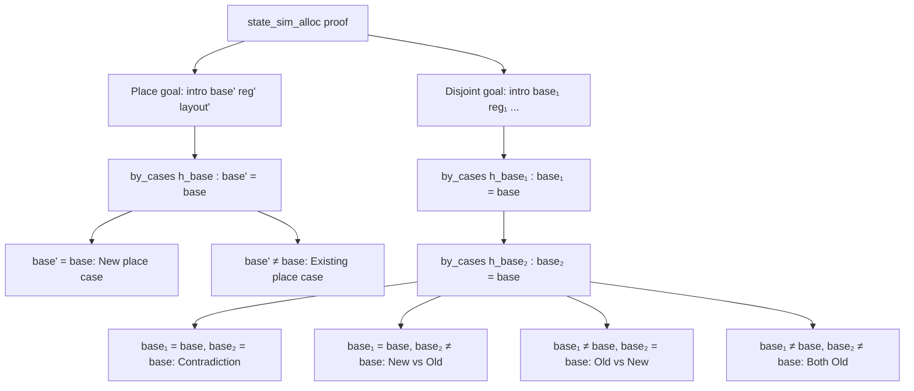

# Refactoring Plan: state_helpers.lean

## Objective
Reduce repetition in `state_sim_alloc` proof by extracting common proof patterns into reusable helper lemmas.

## Current State Analysis

The [`state_sim_alloc`](../src/obseq/proof/state_helpers.lean:1141) theorem (lines 1141-1334) has a 193-line proof with significant repetition. The proof structure:



## Identified Repetitive Patterns

### Pattern 1: Old Lookup and Place Extraction
Appears 4+ times with identical structure:

```lean
have h_lookup_old : π.lookup base' = some (reg', layout') :=
  place_map_lookup_cons_ne h_base h_lookup
let ⟨addr_m, addr_o, tag_m', tag_o', h_ptr, h_block⟩ := StateSim.place h_sim h_lookup_old
```

### Pattern 2: Register Inequality from Freshness
Appears 4+ times:

```lean
have h_reg_ne : reg' ≠ reg := by
  intro h_eq
  subst h_eq
  exact h_reg_fresh base' layout' h_lookup_old
```

### Pattern 3: Applying place_runtime_sim_alloc_write_eq_old
Appears 3 times with nearly identical arguments:

```lean
have h_eq := place_runtime_sim_alloc_write_eq_old
  rfl rfl
  (base := base) (reg := reg) (layout := layout)
  (freshAddr_m := freshAddr_m) (freshAddr_o := freshAddr_o)
  (tag_m := tag_m) (tag_o := tag_o)
  h_pre h_ptr h_base h_reg_ne
```

### Pattern 4: Applying alloc_fresh_disjoint
Appears 3 times:

```lean
have h_fresh :=
  alloc_fresh_disjoint
    (freshAddr_m := freshAddr_m) (freshAddr_o := freshAddr_o) (freshLayout := layout)
    h_sim h_lookup_old h_pre
```

### Pattern 5: Applying place_runtime_sim_alloc_write_new_eq
Appears 2 times:

```lean
have h_new := place_runtime_sim_alloc_write_new_eq
  (ρa' := extendAddrRenameMap ρa freshAddr_m freshAddr_o)
  (ρt' := extendTagRenameMap ρt tag_m tag_o)
  rfl rfl
  (base := base) (reg := reg) (layout := layout)
  (freshAddr_m := freshAddr_m) (freshAddr_o := freshAddr_o)
  (tag_m := tag_m) (tag_o := tag_o) h_ptr
```

## Proposed Helper Lemmas

### Helper 1: `reg_ne_of_place_not_in_π`
Proves register inequality from the freshness hypothesis.

```lean
theorem reg_ne_of_place_not_in_π
  {π : PlaceMap}
  {reg : Register}
  {base' : Word}
  {reg' : Register}
  {layout' : LayoutTy}
  (h_lookup : π.lookup base' = some (reg', layout'))
  (h_fresh : ∀ base layout, π.lookup base = some (reg, layout) → False) :
  reg' ≠ reg := by
  intro h_eq
  subst h_eq
  exact h_fresh base' layout' h_lookup
```

### Helper 2: `place_lookup_old_of_cons`
Bundles the lookup extraction for old places.

```lean
theorem place_lookup_old_of_cons
  {π : PlaceMap}
  {base base' : Word}
  {reg' : Register}
  {layout' : LayoutTy}
  (h_base : base' ≠ base)
  (h_lookup : ((base, (reg, layout)) :: π).lookup base' = some (reg', layout')) :
  π.lookup base' = some (reg', layout') :=
  place_map_lookup_cons_ne h_base h_lookup
```

### Helper 3: `addr_tag_eq_of_place_runtime_sim_alloc_write_eq_old`
Extracts the equality conclusions directly, avoiding repeated rcases.

```lean
theorem addr_tag_eq_of_place_runtime_sim_alloc_write_eq_old
  {π : PlaceMap}
  {ρa_pre ρa_post : AddrRenaming}
  {ρt_pre ρt_post : TagRenaming}
  ... -- same hypotheses as place_runtime_sim_alloc_write_eq_old
  (h_pre : place_runtime_sim π ρa_pre ρt_pre s_mir s_osea base' reg' addr_pre_m addr_pre_o tag_pre_m tag_pre_o layout')
  (h_post : place_runtime_sim ((base, (reg, layout)) :: π) ρa_post ρt_post s_mir' s_osea' base' reg' addr_m addr_o tag_m' tag_o' layout')
  (h_base_ne : base' ≠ base)
  (h_reg_ne : reg' ≠ reg) :
  addr_m = addr_pre_m ∧
  addr_o = addr_pre_o ∧
  tag_m' = tag_pre_m ∧
  tag_o' = tag_pre_o ∧
  ρa_post = extendAddrRenameMap ρa_pre freshAddr_m freshAddr_o ∧
  ρt_post = extendTagRenameMap ρt_pre tag_m tag_o :=
  -- Combine the existing theorem with additional conclusions
```

### Helper 4: `disjoint_new_vs_old`
Handles the new vs old place disjointness case.

```lean
theorem disjoint_new_vs_old
  {π : PlaceMap}
  {ρa : AddrRenaming}
  {ρt : TagRenaming}
  {s_mir : mirlite.State}
  {s_osea : oseair.State}
  {base : Word}
  {reg : Register}
  {layout : LayoutTy}
  {freshAddr_m freshAddr_o : Word}
  {tag_m tag_o : Word}
  {base₂ : Word}
  {reg₂ : Register}
  {layout₂ : LayoutTy}
  {addr₂_m addr₂_o tag₂_m tag₂_o : Word}
  (h_sim : StateSim π ρa ρt s_mir s_osea)
  (h_lookup₂ : π.lookup base₂ = some (reg₂, layout₂))
  (h_ptr₂ : place_runtime_sim π ρa ρt s_mir s_osea base₂ reg₂ addr₂_m addr₂_o tag₂_m tag₂_o layout₂)
  (h_fresh : ∀ base layout, π.lookup base = some (reg, layout) → False)
  (h_base₂ : base₂ ≠ base)
  (h_new_addr_m : Word) (h_new_addr_o : Word)
  (h_new_tag_m : Word) (h_new_tag_o : Word)
  (h_new_ptr : place_runtime_sim ((base, (reg, layout)) :: π) 
    (extendAddrRenameMap ρa freshAddr_m freshAddr_o)
    (extendTagRenameMap ρt tag_m tag_o)
    s_mir' s_osea' base reg h_new_addr_m h_new_addr_o h_new_tag_m h_new_tag_o layout) :
  blocks_disjoint h_new_addr_m (blockSize layout) addr₂_m (blockSize layout₂) ∧
  blocks_disjoint h_new_addr_o (blockSize layout) addr₂_o (blockSize layout₂) := by
  -- Combined proof using alloc_fresh_disjoint
```

### Helper 5: `disjoint_old_vs_old`
Handles the both-old places disjointness case.

```lean
theorem disjoint_old_vs_old
  {π : PlaceMap}
  {ρa : AddrRenaming}
  {ρt : TagRenaming}
  {s_mir : mirlite.State}
  {s_osea : oseair.State}
  {base : Word}
  {reg : Register}
  {layout : LayoutTy}
  {base₁ base₂ : Word}
  {reg₁ reg₂ : Register}
  {layout₁ layout₂ : LayoutTy}
  (h_sim : StateSim π ρa ρt s_mir s_osea)
  (h_lookup₁ : π.lookup base₁ = some (reg₁, layout₁))
  (h_lookup₂ : π.lookup base₂ = some (reg₂, layout₂))
  (h_ne : base₁ ≠ base₂)
  (h_base₁ : base₁ ≠ base)
  (h_base₂ : base₂ ≠ base) :
  -- Returns the disjointness for the old places after allocation
```

## Implementation Steps

1. **Add Helper 1** (`reg_ne_of_place_not_in_π`) before `state_sim_alloc`
   - Simple 5-line lemma
   - Replaces 4 identical proof blocks

2. **Add Helper 2** (`place_lookup_old_of_cons`) 
   - Already exists as `place_map_lookup_cons_ne`, just create an alias or use directly

3. **Add Helper 3** (`addr_tag_eq_of_place_runtime_sim_alloc_write_eq_old`)
   - Combines the eq_old theorem with rcases elimination
   - Reduces 3 identical 10-line blocks to single calls

4. **Add Helper 4** (`disjoint_new_vs_old`)
   - Handles the new vs old case in disjoint goal
   - Eliminates ~30 lines of duplication

5. **Add Helper 5** (`disjoint_old_vs_old`)
   - Handles the both-old case
   - Uses existing `StateSim.disjoint`

6. **Refactor `state_sim_alloc`** to use the helpers
   - Replace repetitive blocks with helper calls
   - Expected reduction: ~80 lines (40% of proof)

## Expected Outcome

| Metric | Before | After |
|--------|--------|-------|
| Total lines | ~193 | ~115 |
| Repetitive blocks | 12 | 0 |
| Helper lemmas added | 0 | 4-5 |
| Proof clarity | Low | High |

## Verification

After refactoring:
1. Ensure all proofs still compile
2. Verify no behavior changes (theorems have same types)
3. Check that helper lemmas are well-documented
